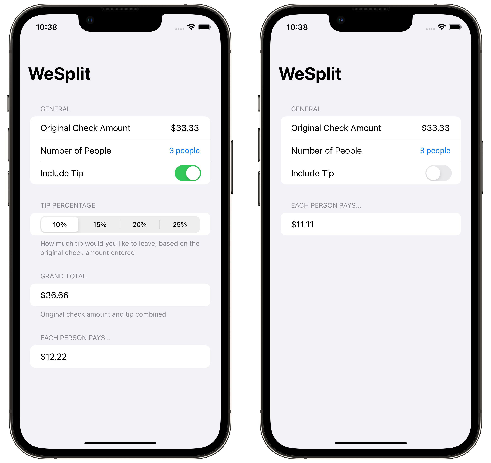

#  WeSplit

## About
An app to calculate bill splitting between people, and let user decide if they want to include a tip for their dedicated server 👨‍🍳

This project is originally a tutorial project from [100 Days of SwiftUI](https://www.hackingwithswift.com/100/swiftui) course by [Paul Hudson](https://twitter.com/twostraws).

## Extensions
Implementation of extra concepts beyond the scope of its original tutorial were made to this project, including:
<table>
	<thead>
		<tr>
			<th>Concept</th>
			<th>Details</th>
		</tr>
	</thead>
	<tbody>
		<tr>
			<td>Components</td>
			<td>Splitting child views into reusable components</td>
		</tr>
		<tr>
			<td>Localization</td>
			<td>Support multiple localized app content, currently English and Vietnamese</td>
		</tr>
		<tr>
			<td>Source of Truth</td>
			<td>Ensure single source of truth in the app, by using property wrappers like @State, @FocusState, @Binding in tandem</td>
		</tr>
		<tr>
			<td>Model</td>
			<td>Refactor convoluted list of view properties into an appropriate model struct</td>
		</tr>
		<tr>
			<td>Toggle for Tip</td>
			<td>Include a toggle to not leave a tip 🥲 and generate the tip and grand total amount dynamically</td>
		</tr>
	</tbody>
</table>

## Screenshot

