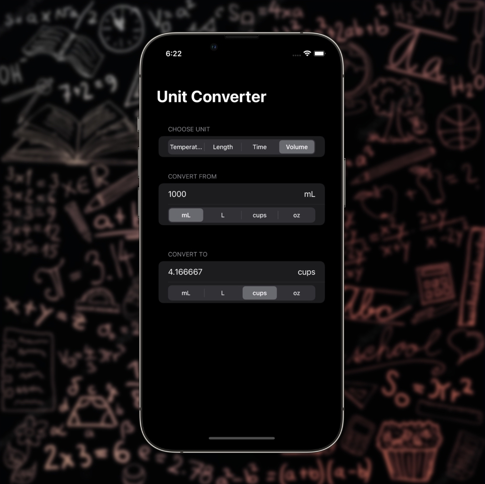

#  Unit Converter

## About
An app to handle unit conversions, supporting temperature, length, time, and volume.

This project is a solo project from [100 Days of SwiftUI](https://www.hackingwithswift.com/100/swiftui) course by [Paul Hudson](https://twitter.com/twostraws).

## Prominent Concepts
Implementation of extra concepts beyond the scope of its original tutorial were made to this project, including:
<table>
	<thead>
		<tr>
			<th>Concept</th>
			<th>Details</th>
		</tr>
	</thead>
	<tbody>
		<tr>
			<td>Components</td>
			<td>Modularize child views into reusable components</td>
		</tr>
		<tr>
			<td>Localization</td>
			<td>Support multiple localized app content, currently English and Vietnamese</td>
		</tr>
		<tr>
			<td>Source of Truth</td>
			<td>Ensure single source of truth in the app, utilize the similar concept of props in React.js to pass two-way binded properties using @State and @Binding</td>
		</tr>
		<tr>
			<td>Models</td>
			<td>Refactor similar convert unit types into appropriate model structs</td>
		</tr>
		<tr>
			<td>Apple's Measurement API</td>
			<td>Utilize built-in Measurement API to handle the conversion from a source unit to destination unit</td>
		</tr>
	</tbody>
</table>

## Screenshot

