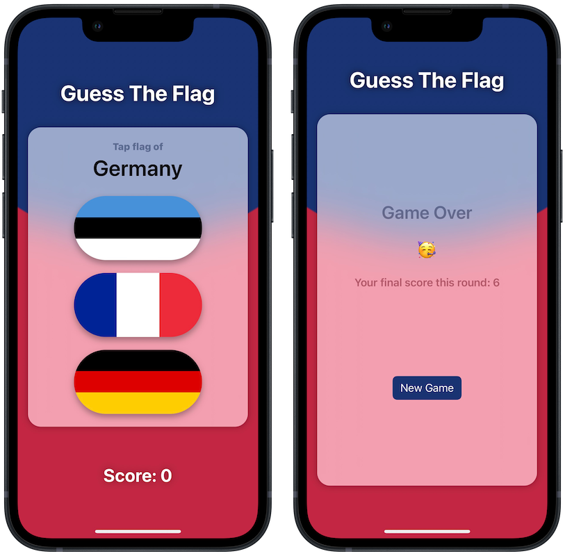

#  Guess Flag 🏁

## About ℹ️
A quiz game asking players to guess the country's flag.

This project is a tutorial project from [100 Days of SwiftUI](https://www.hackingwithswift.com/100/swiftui) course by [Paul Hudson](https://twitter.com/twostraws).

## Functionality Extensions 👨‍💻
I developed extra features beyond the scope of its original tutorial via due research and critical problem-solving skills.
<table>
	<thead>
		<tr>
			<th>Feature</th>
			<th>Details</th>
		</tr>
	</thead>
	<tbody>
		<tr>
			<td>Animations</td>
			<td>
			Animate the UI after player has selected a flag as their answer
			</td>
		</tr>
		<tr>
			<td>Grand Central Dispatch</td>
			<td>
			Auto advance to next question using DispatchQueue asyncAfter API
			</td>
		</tr>
		<tr>
			<td>User Score</td>
			<td>
			Display the score to player after each guess with an alert + in the score section
			</td>
		</tr>
		<tr>
			<td>Action on Wrong Guess</td>
			<td>Let player know they guessed the wrong flag and provide the correct answer</td>
		</tr>
		<tr>
			<td>Reset Game</td>
			<td>Limit the number of questions to 8 (a reasonable number), let players know they reached the limit, and allow them to restart the game</td>
		</tr>
	</tbody>
</table>

## Concept Extensions 👷‍♂️
I also proactively implemented extra concepts on top of the extra features, including:
<table>
	<thead>
		<tr>
			<th>Concept</th>
			<th>Details</th>
		</tr>
	</thead>
	<tbody>
		<tr>
			<td>View Composition</td>
			<td>Modularize child views into reusable components for flexibility and readability</td>
		</tr>
		<tr>
			<td>Localization</td>
			<td>Display multiple languages, currently English, Vietnamese, and Chinese (Simplified). Adapted to Apple best practices of accessibility</td>
		</tr>
		<tr>
			<td>Design Pattern</td>
			<td>Build the structure using principles of Strategy design pattern in mind. Refactor properties & functionalities into modules</td>
		</tr>
		<tr>
			<td>Single Source of Truth</td>
			<td>Ensure single source of truth in the app, utilize the similar concept of <b>props</b> in React.js to pass two-way binded properties using @State and @Binding</td>
		</tr>
	</tbody>
</table>

## Screenshot 📸

