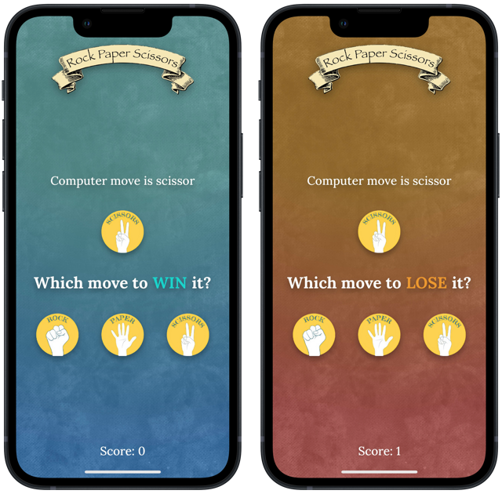

#  RPS
## About ℹ️
RPS is simply short for Rock-Paper-Scissors.

The gameplay is random: you either play to win or lose to a randomly generated hand gesture.

This project is a solo project from [100 Days of SwiftUI](https://www.hackingwithswift.com/100/swiftui) course by [Paul Hudson](https://twitter.com/twostraws). This is on day 25, for a milestone project.

## Prominent Concepts 👨‍💻
I developed the app with knowledge learned from previous course modules, along with those I learned from experience with React.js, readable code, language translations, etc. More key concepts below, including:
<table>
	<thead>
		<tr>
			<th>Feature</th>
			<th>Details</th>
		</tr>
	</thead>
	<tbody>
		<tr>
			<td>Localization</td>
			<td>Display multiple languages, currently English, Vietnamese, and Chinese (Simplified). Adapted to Apple best practices of accessibility</td>
		</tr>
		<tr>
			<td>Single Source of Truth</td>
			<td>Ensure single source of truth in the app, utilize the similar concept of <b>props</b> in React.js to pass two-way binded properties using @State and @Binding</td>
		</tr>
		<tr>
			<td>Image Resources</td>
			<td>Hand gesture and app icon images were manually generated. I collected templates then later used Pixelmator to create the image assets</td>
		</tr>
		<tr>
			<td>Modularization</td>
			<td>Tried my best to organize the code with a sensible folder structure, thinking I could help my future self to look back and understand the code better (or another colleague developer, in a professional environment)</td>
		</tr>
	</tbody>
</table>

## Screenshot 📸

