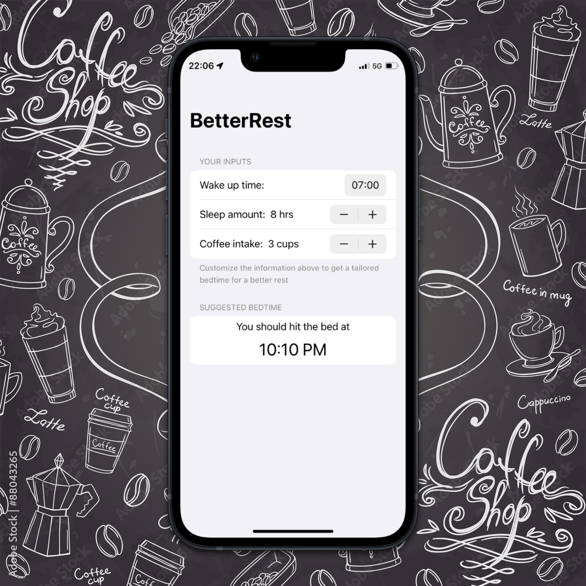

#  BetterRest

## About ℹ️
BetterRest suggests its user a specific time they should go to bed, based on their inputs on their preferred time to wake up, desired amount of sleep, and how many cups of coffee they drank that day.

This project is a tutorial project from [100 Days of SwiftUI](https://www.hackingwithswift.com/100/swiftui) course by [Paul Hudson](https://twitter.com/twostraws).

## Functionality Extensions 👨‍💻
I developed extra features beyond the scope of its original tutorial with due research and critical problem-solving skills.
<table>
	<thead>
		<tr>
			<th>Feature</th>
			<th>Details</th>
		</tr>
	</thead>
	<tbody>
		<tr>
			<td>Dynamic Bedtime Generation</td>
			<td>
			Display the suggested bedtime dynamically at the bottom of the app. No need to click any button to calculate it
			</td>
		</tr>
		<tr>
			<td>UI</td>
			<td>Neatly organize UI elements to be intuitive to users</td>
		</tr>
	</tbody>
</table>

## Concept Extensions 👷‍♂️
I also proactively implemented extra concepts on top of the features above, including:
<table>
	<thead>
		<tr>
			<th>Concept</th>
			<th>Details</th>
		</tr>
	</thead>
	<tbody>
		<tr>
			<td>View Composition</td>
			<td>Modularize child views into reusable components for flexibility and readability</td>
		</tr>
		<tr>
			<td>Single Source of Truth</td>
			<td>Ensure single source of truth in the app, utilize the similar concept of <b>props</b> in React.js to pass two-way binded properties using @State and @Binding</td>
		</tr>
	</tbody>
</table>

## Screenshot 📸

