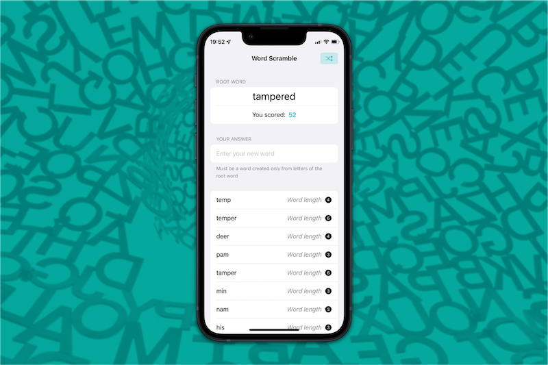

#  Word Scramble

## About ℹ️
Word Scramble is a word game where players enter new words that have letters made up from an original randomly-selected root word.

This project is a tutorial project from [100 Days of SwiftUI](https://www.hackingwithswift.com/100/swiftui) course by [Paul Hudson](https://twitter.com/twostraws).

## Functionality Extensions 👨‍💻
I developed extra features beyond the scope of its original tutorial with due research, code refactoring and critical problem-solving skills.
<table>
	<thead>
		<tr>
			<th>Feature</th>
			<th>Details</th>
		</tr>
	</thead>
	<tbody>
		<tr>
			<td>New Root Word</td>
			<td>
			Players can click a button to generate a new root word to continue the game whenever they like
			</td>
		</tr>
		<tr>
			<td>User Score</td>
			<td>Display scores that a player has accummulated based on word lengths</td>
		</tr>
		<tr>
			<td>Extra Answer Validations</td>
			<td>Players can't cheat answers that are shorter than three letters or are just the root word</td>
		</tr>
	</tbody>
</table>

## Concept Extensions 👷‍♂️
I also proactively implemented extra concepts on top of the features above, including:
<table>
	<thead>
		<tr>
			<th>Concept</th>
			<th>Details</th>
		</tr>
	</thead>
	<tbody>
		<tr>
			<td>Design Pattern</td>
			<td>Implemented the Strategy pattern, as well as separation of concerns and decoupling in separate structs and extensions</td>
		</tr>
		<tr>
			<td>View Composition</td>
			<td>Modularize child views into reusable components for flexibility and readability</td>
		</tr>
		<tr>
			<td>Single Source of Truth</td>
			<td>Ensure single source of truth in the app, utilize the similar concept of <b>props</b> in React.js to pass two-way binded properties using @State and @Binding</td>
		</tr>
		<tr>
			<td>Clean Code Principles</td>
			<td>Main code is very English-like and easily readable, sparing more convoluted method calls in implementation structs</td>
		</tr>
	</tbody>
</table>

## Screenshot 📸

