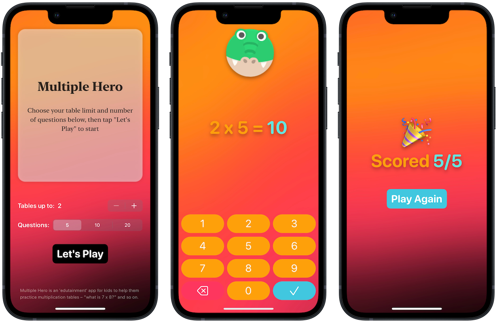

#  Multiple Hero
## About ℹ️
Mutliple Hero is an "edutainment" app to let kids practice multiplication tables. The "edu" lies in that idea. "-tainment" part is in the fun animations and colorful animal mascots displayed throughout a game.

This project is a completely solo project from [100 Days of SwiftUI](https://www.hackingwithswift.com/100/swiftui) course by [Paul Hudson](https://twitter.com/twostraws). It is on day 35, for a milestone project.

## Prominent Concepts 👨‍💻
I developed the app with knowledge learned from previous course modules, along with those I learned from experience with React.js, readable code, etc. More key concepts below, including:
<table>
	<thead>
		<tr>
			<th>Feature</th>
			<th>Details</th>
		</tr>
	</thead>
	<tbody>
		<tr>
			<td>Localization</td>
			<td>Support multiple languages, currently English and Vietnamese.</td>
		</tr>
		<tr>
			<td>Single Source of Truth</td>
			<td>Ensure single source of truth in the app, utilize the similar concept of <b>props</b> in React.js to pass two-way binded properties using @State and @Binding</td>
		</tr>
		<tr>
			<td>Animations</td>
			<td>Multiple types of SwiftUI animations in this game, including ease-in-out, wiggling, offset, and so on.</td>
		</tr>
		<tr>
			<td>Modularization</td>
			<td>Tried my best to organize the code with a sensible folder structure, thinking I could help my future self to look back and understand the code better (or another colleague developer, in a professional environment)</td>
		</tr>
		<tr>
			<td>Custom Keypad</td>
			<td>A completely customized keypad for the game is built from scratch, with each button tap performing a separate action.</td>
		</tr>
	</tbody>
</table>

## Screenshot 📸

