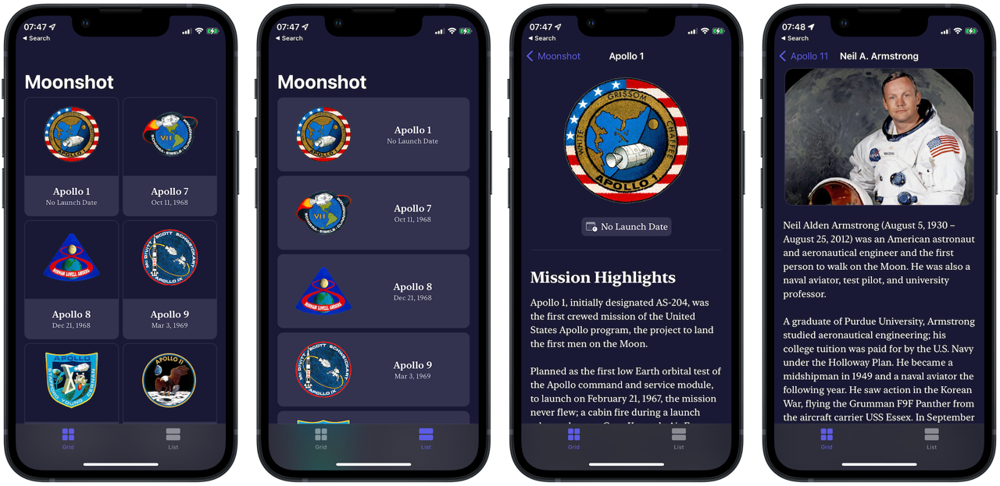

#  Moonshot 🌔

## About
Moonshot is a space-themed reference app that provides information about Apollo missions and their crew members. Source is credited to Wikipedia and its authors under the [CC-BY-SA licence](https://creativecommons.org/licenses/by-sa/3.0)

This project was a tutorial project from [100 Days of SwiftUI](https://www.hackingwithswift.com/100/swiftui) course by [Paul Hudson](https://twitter.com/twostraws).

## Functionality Extensions 👨‍💻
I developed extra features beyond the scope of its original tutorial with due research, code refactoring and critical problem-solving skills.
<table>
	<thead>
		<tr>
			<th>Proniment Feature</th>
			<th>Details</th>
		</tr>
	</thead>
	<tbody>
		<tr>
			<td>Tab view for different layouts</td>
			<td>
			The two layouts of grid/list style is embedded in a Tab view, so app users could browse 2 pieces of contents simultaneously. Both layout views utilize the same type of view model.
			</td>
		</tr>
		<tr>
			<td>Serif font style</td>
			<td>Make use of Apple's built-in serif font style for a formal reading experience.</td>
		</tr>
	</tbody>
</table>

## Concept Extensions
I faced challenges refactoring the original tutorial code into my coding style. Ultimately, implementation of extra technical concepts beyond the code's original scope were made to this project, including:
<table>
	<thead>
		<tr>
			<th>Concept</th>
			<th>Details</th>
		</tr>
	</thead>
	<tbody>
		<tr>
			<td>Model-View-ViewModel</td>
			<td>The entire app is refactored to implement MVVM design architecture.</td>
		</tr>
		<tr>
			<td>Code Organization</td>
			<td>Neatly break up code & organizaze into different modules to easily scale or maintain the app</td>
		</tr>
		<tr>
			<td>Documentation</td>
			<td>I provided explanations to how to use certain modules via clear documentation, given the original tutorial code was a tad convoluted and required much time studying its whys and hows.</td>
		</tr>
		<tr>
			<td>Readability</td>
			<td>With minor but thoughtful changes across the refactored code, it became much more readable as I see it. Therefore, my future self (or a colleague dev, any prospective dev who might refer to my code) spend less time getting used to the logic and more on the flow of data.</td>
		</tr>
	</tbody>
</table>

## Screenshot
