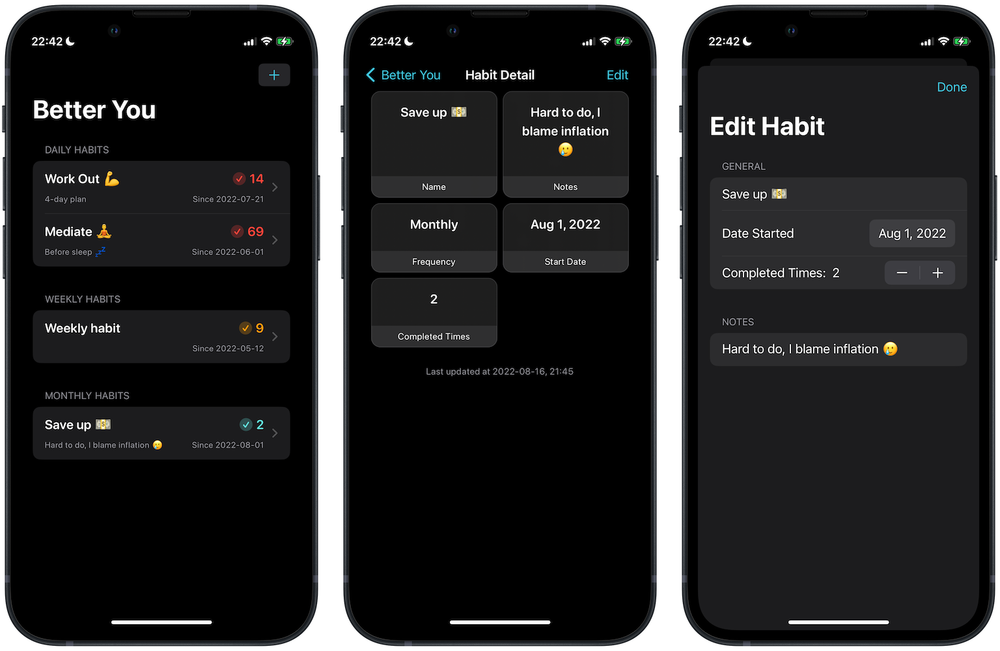

#  Better You ☘️

## About
Better You is a habit tracker app, built using SwiftUI, and support full CRUD (create-read-update-delete) operations.

This project was a solo project, built from scratch, from [100 Days of SwiftUI](https://www.hackingwithswift.com/100/swiftui) course by [Paul Hudson](https://twitter.com/twostraws).

## Technical Concepts 👨‍💻
I developed the app with knowledge learned from previous course modules, along with those I learned from experience with React.js, readable code, etc. More key concepts below, including:
<table>
	<thead>
		<tr>
			<th>Concept</th>
			<th>Details</th>
		</tr>
	</thead>
	<tbody>
		<tr>
			<td>Model-View-ViewModel</td>
			<td>The entire app is refactored to implement MVVM design architecture.</td>
		</tr>
		<tr>
			<td>Code Organization</td>
			<td>Neatly break up code & organizaze into different modules to easily scale or maintain the app</td>
		</tr>
	</tbody>
</table>

## Challenges
I faced challenges attempting to refactor persistence properties and habit arrays in `HomeView.ViewModel` into separate classes to comply to SOLID principles.

A persistence bug caused data to be overwritten. Therefore, I noted that in my current code base. Hopefully going forward with the course, I'd be able to find a solution soon 🙂

## Screenshot 📸
