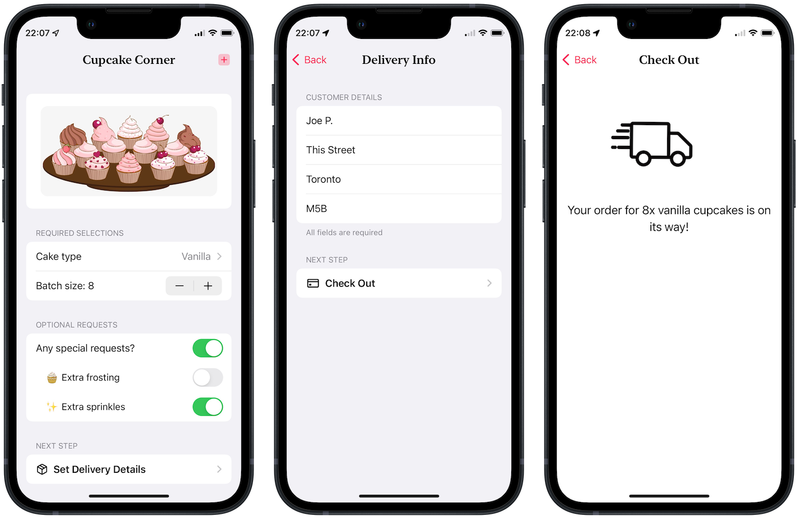

#  Cupcake Corner 🧁

## About
Cupcake Corner is a boutique-themed app that replicates the process of ordering pastry delivery. The shop is an product of imagination though, so enjoy your free not non-physical cupcakes haha!

This project was a tutorial project from [100 Days of SwiftUI](https://www.hackingwithswift.com/100/swiftui) course by [Paul Hudson](https://twitter.com/twostraws).

## Functionality Extensions 👨‍💻
I developed extra features beyond the scope of its original tutorial with due research, code refactoring and critical problem-solving skills.
<table>
	<thead>
		<tr>
			<th>Proniment Feature</th>
			<th>Details</th>
		</tr>
	</thead>
	<tbody>
		<tr>
			<td>UI Elements</td>
			<td>Revamped the UI of the whole app with details to provide users a more gratifying shopping experience.</td>
		</tr>
		<tr>
			<td>Address Validation</td>
			<td>
			Added validations to ensure customers don't just input whitespaces in address fields.
			</td>
		</tr>
		<tr>
			<td>Create new order</td>
			<td>Support generating a new batch or cupcake orders via the navigation bar button in home view.</td>
		</tr>
	</tbody>
</table>

## Concept Extensions
I faced challenges refactoring the original tutorial code into my coding style. Ultimately, implementation of extra technical concepts beyond the code's original scope were made to this project, including:
<table>
	<thead>
		<tr>
			<th>Concept</th>
			<th>Details</th>
		</tr>
	</thead>
	<tbody>
		<tr>
			<td>Model-View-ViewModel</td>
			<td>The entire app is refactored to implement MVVM design architecture.</td>
		</tr>
		<tr>
			<td>Refactoring & Organization</td>
			<td>Neatly break up code & organizaze into different modules to reduce decoupling and easier to maintain the app. The original tutorial code was a tad convoluted and required much time studying its whys and hows.</td>
		</tr>
		<tr>
			<td>Readability</td>
			<td>With minor but thoughtful changes across the refactored code, it became much more readable as I see it. Therefore, my future self (or a colleague dev, any prospective dev who might refer to my code) spend less time getting used to the logic and more on the flow of data.</td>
		</tr>
	</tbody>
</table>

## Screenshot
