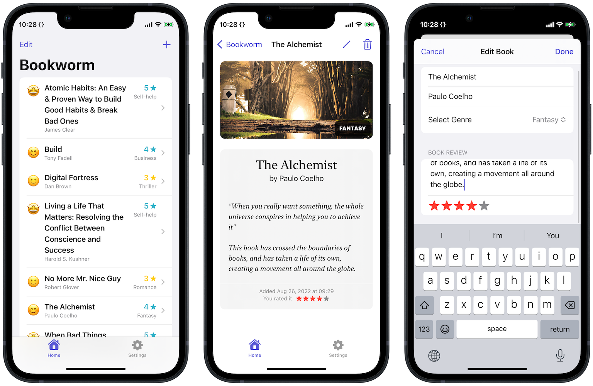

#  Bookworm 📚

## About
Bookworm is an app that utilizes Core Data, and lets you log the books you've read.

This project was originally a tutorial project from [100 Days of SwiftUI](https://www.hackingwithswift.com/100/swiftui) course by [Paul Hudson](https://twitter.com/twostraws).

## Functionality Extensions 👨‍💻
I developed extra features beyond the scope of its original tutorial with due research, code refactoring and critical problem-solving skills.
<table>
	<thead>
		<tr>
			<th>Proniment Feature</th>
			<th>Details</th>
		</tr>
	</thead>
	<tbody>
		<tr>
			<td>UI Elements</td>
			<td>Revamped the UI of the whole app to provide users a more pleasing experience.</td>
		</tr>
		<tr>
			<td>Input Validation</td>
			<td>
			Added validations to ensure users don't just input whitespaces when logging a book.
			</td>
		</tr>
	</tbody>
</table>

## Concept Extensions
I faced challenges refactoring the original tutorial code into my coding style. Ultimately, implementation of extra technical concepts beyond the code's original scope were made to this project, including:
<table>
	<thead>
		<tr>
			<th>Concept</th>
			<th>Details</th>
		</tr>
	</thead>
	<tbody>
		<tr>
			<td>Model-View-ViewModel with Core Data</td>
			<td>The entire app is refactored to implement MVVM design architecture. View models host a reference to the singleton Core Data stack accordingly.</td>
		</tr>
		<tr>
			<td>Refactoring & Organization</td>
			<td>Neatly break up code & organizaze into different modules to reduce decoupling and easier to maintain the app. The original tutorial code was a tad convoluted and required much time studying its whys and hows.</td>
		</tr>
		<tr>
			<td>Readability</td>
			<td>With minor but thoughtful changes across the refactored code, it became much more readable as I see it. Therefore, my future self (or a colleague dev, any prospective dev who might refer to my code) spend less time getting used to the logic and more on the flow of data.</td>
		</tr>
	</tbody>
</table>

## Screenshot
