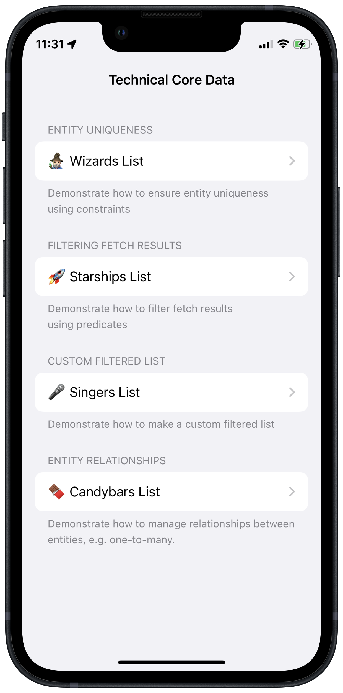

#  Technical Core Data 🛠

## About
Technical Core Data is a technical app that utilizes Core Data, showcasing how it could be used in SwiftUI.

This project was a tutorial project from [100 Days of SwiftUI](https://www.hackingwithswift.com/100/swiftui) course by [Paul Hudson](https://twitter.com/twostraws).

## Functionality Extensions 👨‍💻
I developed extra features beyond the scope of its original tutorial with due research, code refactoring and critical problem-solving skills. Below are what I did differently than the tutorial code:
<table>
	<thead>
		<tr>
			<th>Proniment Feature</th>
			<th>Details</th>
		</tr>
	</thead>
	<tbody>
		<tr>
			<td>Separate Predicate constants and factory</td>
			<td>Created a designated <pre>Predicates</pre> enum to provide a one-stop access and for separation of concern. Implemented a Simple Factory pattern idiom with its child <pre>Factory</pre> enum.</td>
		</tr>
		<tr>
			<td>UI Elements</td>
			<td>Embeded all views in a navigation view, with short section headers and footers to provide more context what each view should be showcasing.</td>
		</tr>
		<tr>
			<td>Improvements to <pre>FilteredList</pre></td>
			<td>
			Added initializer parameters to dynamically cater to different predicate types, sort descriptors. Provided detailed documentation of this custom view, too.
			</td>
		</tr>
	</tbody>
</table>

## Concept Extensions
Implementation of extra technical concepts beyond the code's original scope were made to this project, including:
<table>
	<thead>
		<tr>
			<th>Concept</th>
			<th>Details</th>
		</tr>
	</thead>
	<tbody>
		<tr>
			<td>Refactoring & Organization</td>
			<td>Neatly break up code & organizaze into different modules to reduce decoupling and easier to maintain the app. The original tutorial code was a tad convoluted and required much time studying its whys and hows.</td>
		</tr>
		<tr>
			<td>Readability</td>
			<td>With minor but thoughtful changes across the refactored code, it became much more readable as I see it. Therefore, my future self (or a colleague dev, any prospective dev who might refer to my code) spend less time getting used to the logic and more on the flow of data.</td>
		</tr>
	</tbody>
</table>

## Screenshot

