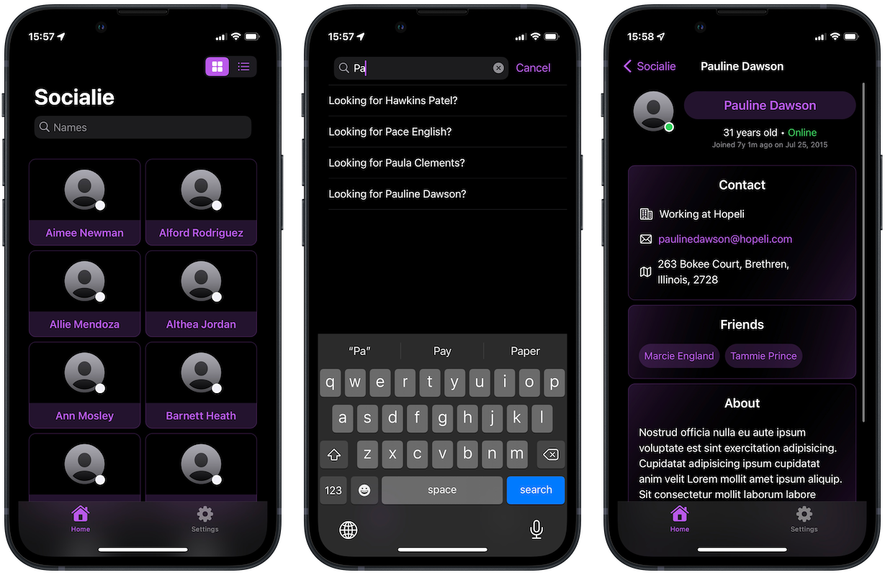

#  Socialie 👥
## About
Sociale is a SwiftUI social-themed app, built from scratch. It fetches source JSON data when there's Internet, then switches to cached data in case of no network connection. Of course, new data could be added on the remote source, and Socialie would still work just as desired.

Originally, Socialie was only designed to work with 100% Internet connection in mind. Later, it underwent a typical "scope creep" being required to deploy offline data caching. It was a difficult challenge, and I managed to nail it!

This project was a solo project, from [100 Days of SwiftUI](https://www.hackingwithswift.com/100/swiftui) course by [Paul Hudson](https://twitter.com/twostraws).

## Technical Concepts 👨‍💻
I developed the app with knowledge learned from previous course modules, along with active research of new concepts to expand its functionalities. More key concepts below, including:
<table>
	<thead>
		<tr>
			<th>Concept</th>
			<th>Details</th>
		</tr>
	</thead>
	<tbody>
		<tr>
			<td>Model-View-ViewModel</td>
			<td>The entire app embraces the implementation of MVVM design architecture.</td>
		</tr>
		<tr>
			<td>API Fetching</td>
			<td>JSON data fetched from an API is decoded and displayed to users.</td>
		</tr>
		<tr>
			<td>Core Data Caching</td>
			<td>JSON data fetched is cached into different entities, and Socialie app is shifted to utilizing it so the app remains usable even when offline.</td>
		</tr>
		<tr>
			<td>Protocol-Orientation</td>
			<td>I built relevant modules to be swappable and scalable via protocols, including the API layer and persistence layer.</td>
		</tr>
		<tr>
			<td>Unit Testing</td>
			<td>A simple unit test was built to ensure the stability of current code and aid its future scalability.</td>
		</tr>
		<tr>
			<td>Code Organization</td>
			<td>Neatly break up code & organizaze into different modules to easily scale or maintain the app</td>
		</tr>
	</tbody>
</table>

## Challenges
As aforementioned, adding `Core Data` to Socialie was mentioned by the course instructor "a hard challenge". I spent several hours learning from extra resources and planning implementation (reviewing the code, refactoring it, etc.) before being able to make it happen.

Besides, the UI was a bit rough and colorful initially. I learned to receive constructive feedbacks from my fellow developers (and friends) to modify UI elements, resulting in the current improved state.

## Screenshot 📸
